# Introduction

This project was developed according to the Full Stack Development
Challenge - it was developed using Python, MySQL, React and a custom
developed REST API using Python. Please note that this ReadMe was
compiled and tested on a Windows 11 Operating System.

# Application Prerequisites 

## Set Up MySQL Server

1.  Download and install: <https://dev.mysql.com/downloads/mysql/>

2.  Select the option for server as shown below then click "Next".

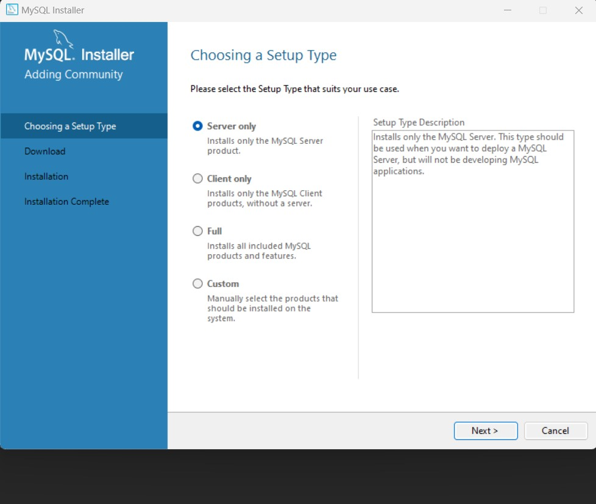

3.  Click Next until the installation and finished.

4.  A configuration wizard for the database will appear thereafter. Use
    the default settings for networking.

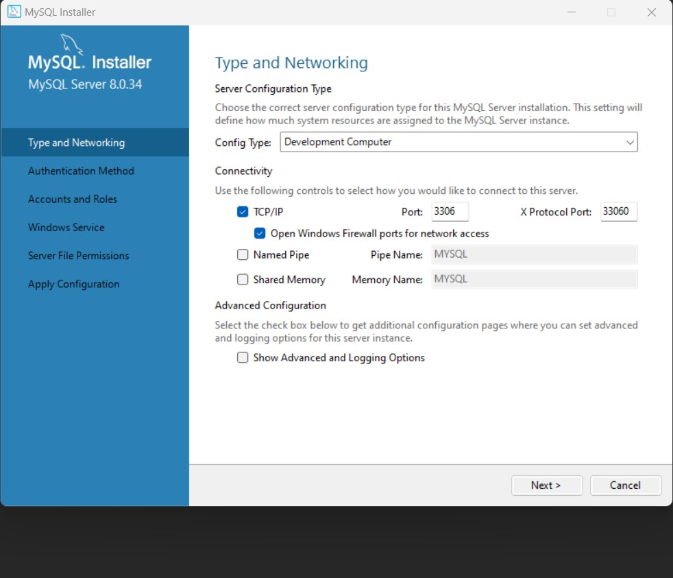

5.  For account and roles, enter the below root password:

    a.  Root password: Fu11St@ckCh@113ng3

6.  Thereafter, click next until the configuration has completed.

##  Set up MySQL Workbench and import database

1.  Download and install: <https://dev.mysql.com/downloads/installer/>

2.  Follow the onscreen prompts until the installation is complete.

3.  Access the GitHub software repository and download the exported
    database which will be in the folder named Database.

4.  Open MySQL workbench. Navigate to Database \> Connect to Database
    from the menu at the top of the application.

5.  Replicate the below configuration. Select the button named "Store in
    vault" and enter the password for the root account then select OK.

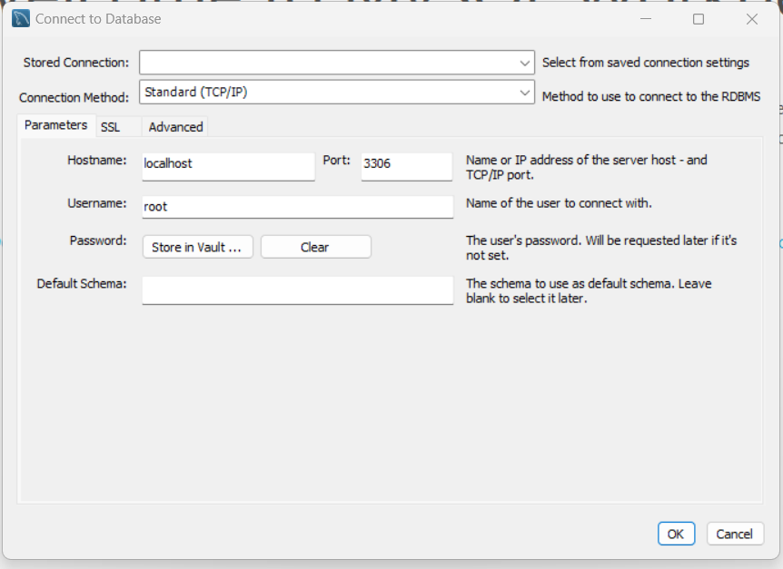

6.  After adding a connection, you will see the connection added under
    MySQL connections. Select this connection.

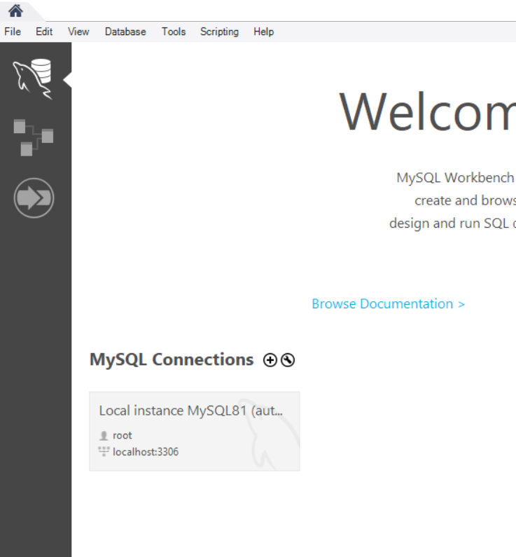

7.  From the MySQL connection, select the Data Import/Restore option for
    the menu on the left.

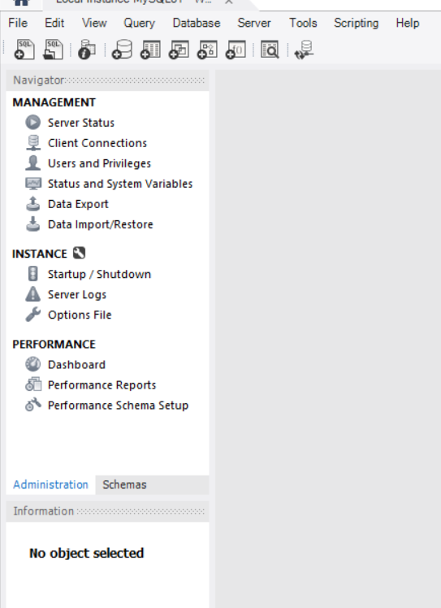

8.  Select the Import from dump project option and select the folder
    with the downloaded Database Export from GitHub.

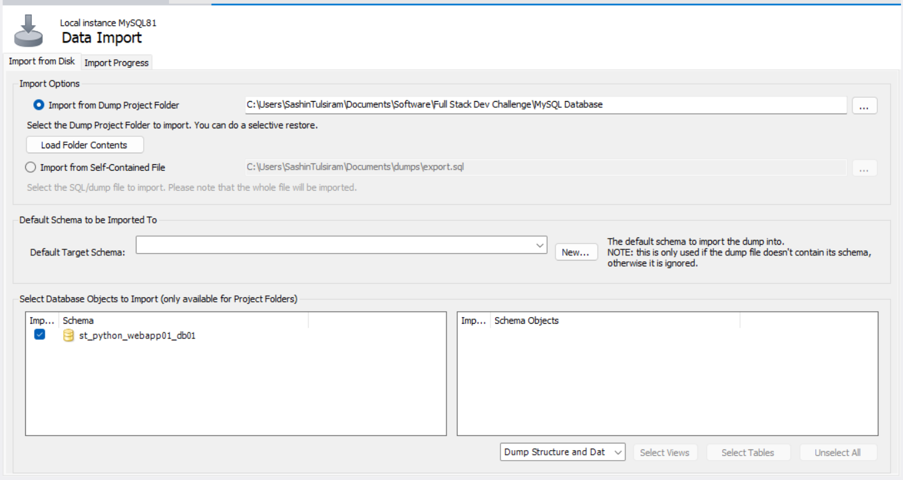

9.  In the Default Schema field, click on the New button then enter in
    st_python_webapp01_db01 for the Default Schema name. Click on the
    highlighted schema as shown in the image below. This will update the
    schema objects table.

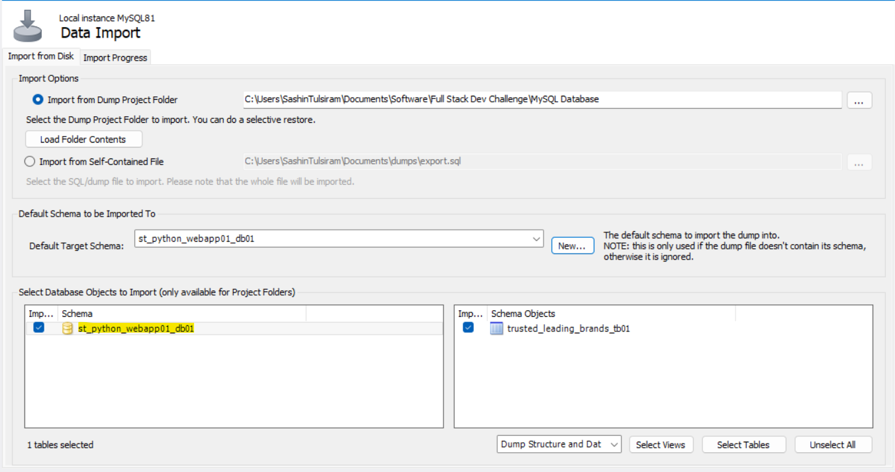

10. Next, click on the tab at the top named Import Progress and select
    the button to Start Import.

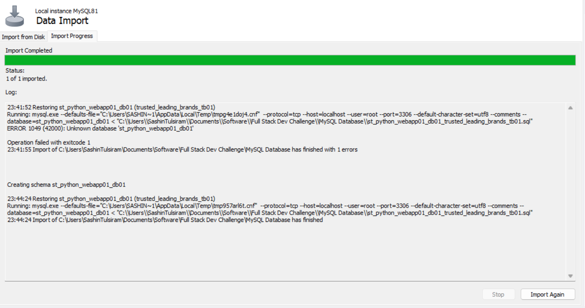
11. You will then be able to access the database from MySQL workbench
    and view the data stored in the database.

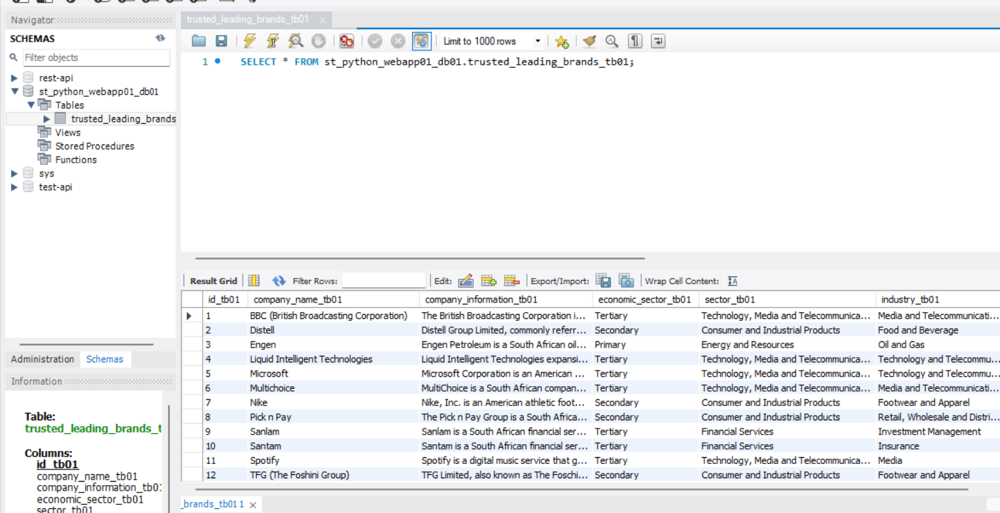

## Install NodeJS 20.5.1

1.  Download and install NodeJS:
    <https://nodejs.org/en/download/current>

## Install Python 3.11.x

1.  Download and install Python: <https://www.python.org/downloads/>

## Clone the GitHub repository

1.  [https://github.com/sashintulsiram/Python-Web-App-1.0.git](https://github.com/sashintulsiram/Python-Web-App-1.0/tree/build)

## Create a virtual environment

1.  From CMD, open the directory for the cloned GitHub repository and
    run the command: cd webapp

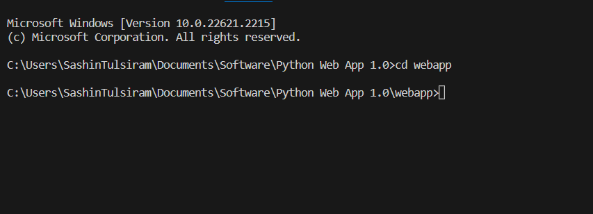

2.  Run the command: python -m venv venv

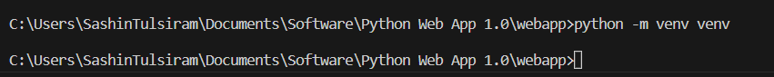

3.  Run the command: venv\\Scripts\\activate

4.  Run the command: pip install -r requirements.txt

5.  Run the command: deactivate

# Test Web Application 

## Start Web Application

1.  Start Web Application --

    a.  From CMD, open the directory for the cloned GitHub repository
        and run the command: cd webapp
    b.	Run the command to start the web application which will activate the virtual environment and run the python web application file: app.bat

    b. The web application will be served on http://localhost:5000. Open this URL in your web browser to access the application.

    c. To stop the web application, go back to the CMD terminal where you have run the app.bat command from. Type CTRL+C and then ‘y’. 

    d. Run the command to deactivate the virtual environment: deactivate
 

## Using Filter Search 

1.  From the webpage, you will be able to use the filter search option
    to search for Trusted Brands in the following fields:

-   Company name: Enter in the name of the company.

-   Economic Sector: Primary / Secondary / Tertiary

-   Industries: Food and Beverage, Investment Management, Banking and
    Securities, Insurance, Footwear and Apparel, Technology,
    Telecommunication, Media

-   Sector: Technology, Telecommunications, Consumer, Retail, Energy and
    Resources, Financial Services.

## Using Sort Button

1.  From the webpage, you will be able to sort the Trusted Brands
    retrieved from the API in alphabetical order.

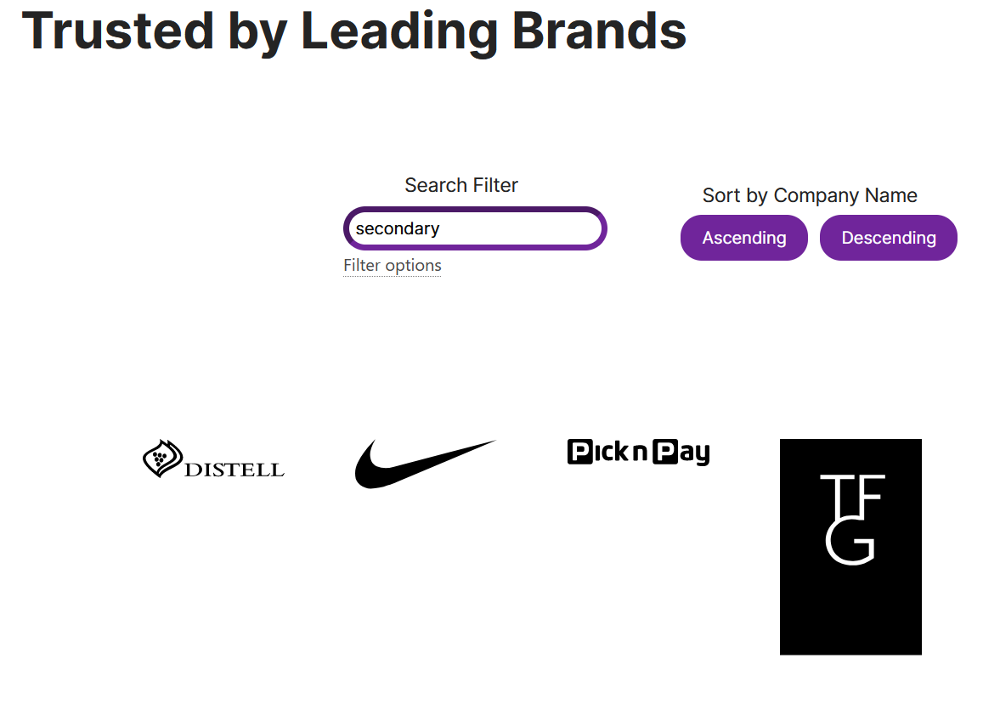

## Illustration of Web Application

# Contact Information

Please contact me on any of the below channels if you require assistance
in setting up your web application.

-   Email: sashintulsiram@gmail.com

-   Phone: 074 939 6705

-   WhatsApp: 074 939 6705
